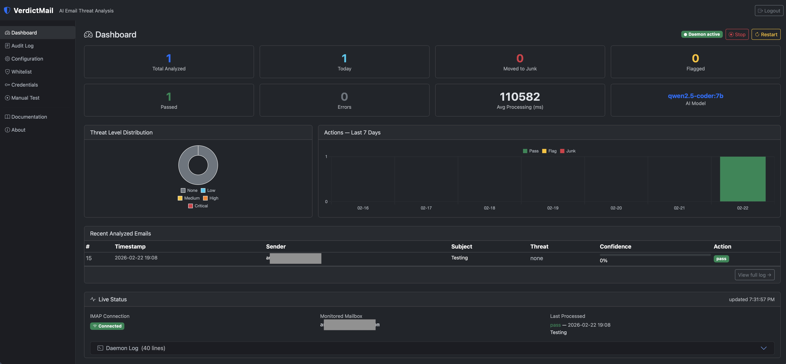
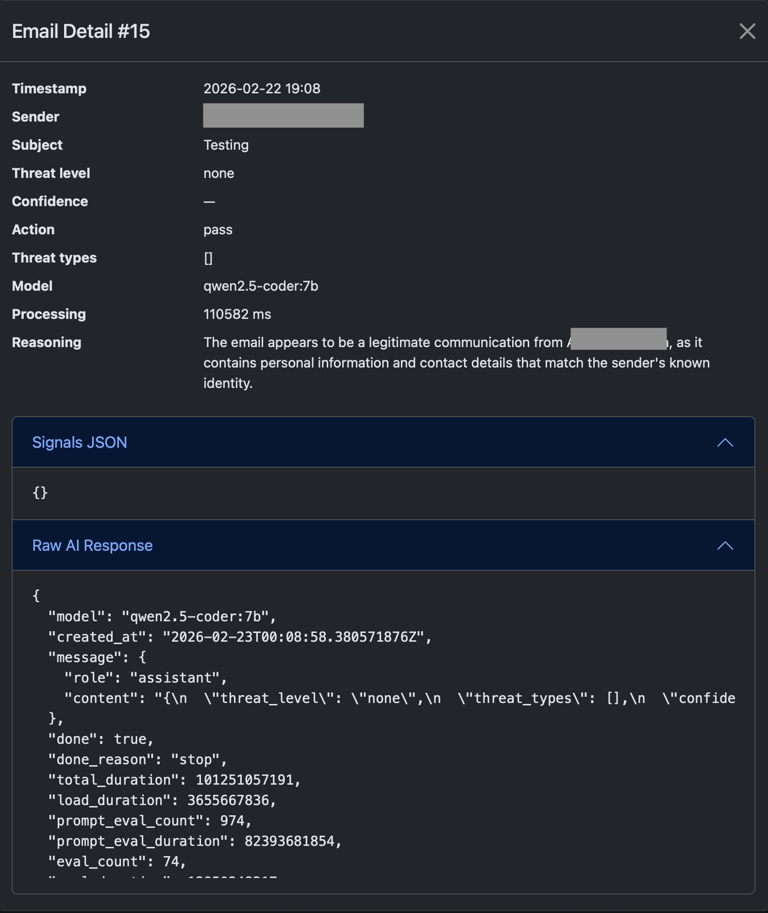
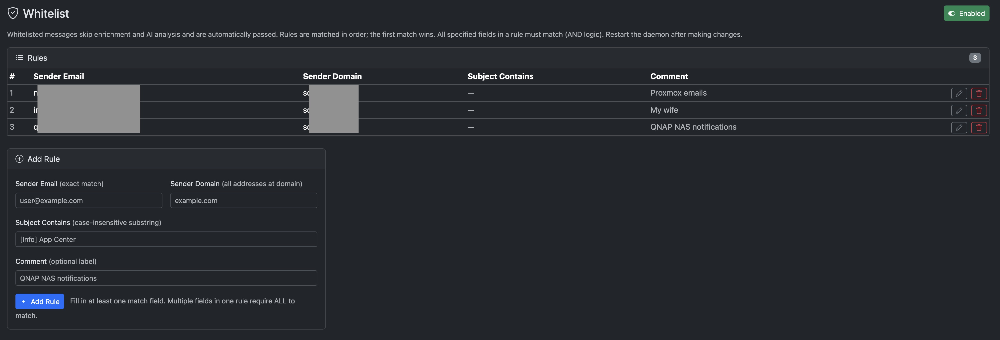

<p align="center">
  
</p>

# VerdictMail


AI-powered email threat analysis daemon for Gmail. Monitors your inbox via IMAP IDLE and runs every incoming message through a multi-stage enrichment and AI analysis pipeline — automatically passing, flagging, or moving suspicious mail to Junk.

---

## Features

- **Real-time monitoring** via IMAP IDLE (push, no polling)
- **Multi-stage pipeline**: parse → whitelist check → enrich → AI → decide → act → audit
- **Enrichment signals**: SPF, DKIM, DMARC, DNSBL reputation, WHOIS domain age, display-name spoofing, URL expansion
- **AI providers**: OpenAI, Anthropic, or a local [Ollama](https://ollama.com) instance
- **Three actions**: pass (no change), flag (IMAP keyword), move to `[Gmail]/Spam`
- **Whitelist**: exempt trusted senders from analysis by email, domain, or subject pattern
- **Web UI**: Flask admin interface — dashboard, audit log, configuration, whitelist, credentials, manual test, documentation
- **Audit log**: full SQLite record of every decision including signals, reasoning, and processing time

---

## Screenshots

<table>
  <tr>
    <td align="center" colspan="2">
      
      <br/><em>Dashboard — live stats, threat distribution, 7-day action chart, and IMAP status</em>
    </td>
  </tr>
  <tr>
    <td align="center">
      
      <br/><em>Audit log — full AI reasoning, signals, and raw model response per email</em>
    </td>
    <td align="center">
      
      <br/><em>Whitelist — trusted sender rules by address, domain, or subject</em>
    </td>
  </tr>
</table>

---

## Architecture

```
IMAP IDLE (main thread)
    │
    └─▶ ThreadPoolExecutor (worker threads)
            │
            ├── message_parser   — RFC 822 parsing, URL extraction
            ├── whitelist        — bypass enrichment/AI for trusted senders
            ├── enrichment       — SPF/DMARC/DKIM/DNSBL/WHOIS/URL expansion
            ├── ai_analyzer      — OpenAI / Anthropic / Ollama via httpx
            ├── decision_engine  — threshold logic → PASS / FLAG / MOVE_TO_JUNK
            ├── imap_actions     — set $VerdictMail-Suspect keyword or copy+delete
            └── audit_logger     — SQLite + rotating log file
```

---

## Requirements

- Ubuntu 22.04 LTS or 24.04 LTS (or any systemd-based Linux), running as root for installation
- Python 3.11+
- A Gmail account with IMAP enabled (Gmail Settings → See all settings → Forwarding and POP/IMAP → Enable IMAP) and a [Gmail App Password](https://support.google.com/accounts/answer/185833) generated. Other IMAP providers should work too — see [Other IMAP providers](#other-imap-providers) below.
- Port 80 free on the host (used by the web UI)
- One of:
  - An OpenAI API key
  - An Anthropic API key
  - A running [Ollama](https://ollama.com) instance (local or remote) with a model pulled (e.g. `ollama pull qwen2.5-coder:14b`)

---

## Installation

### 1. Install system dependencies

```bash
apt-get update
apt-get install -y git python3 python3-venv python3-dev python3-pip \
                   build-essential libssl-dev sqlite3
```

### 2. Create the service user and directories

```bash
useradd -r -s /bin/false -M -d /opt/verdictmail verdictmail
mkdir -p /opt/verdictmail /var/log/verdictmail
chown verdictmail:verdictmail /opt/verdictmail /var/log/verdictmail
```

### 3. Clone the repository

```bash
git clone https://github.com/ascarola/verdictmail.git /opt/verdictmail
chown -R verdictmail:verdictmail /opt/verdictmail
```

### 4. Create the virtual environment and install dependencies

```bash
python3 -m venv /opt/verdictmail/venv
/opt/verdictmail/venv/bin/pip install --upgrade pip
/opt/verdictmail/venv/bin/pip install -r /opt/verdictmail/requirements.txt
chown -R verdictmail:verdictmail /opt/verdictmail/venv
```

### 5. Configure credentials

```bash
cp /opt/verdictmail/.env.example /opt/verdictmail/.env
chown verdictmail:verdictmail /opt/verdictmail/.env
chmod 600 /opt/verdictmail/.env
```

Edit `/opt/verdictmail/.env` and fill in your Gmail credentials and AI provider API key.

### 6. Configure the application

```bash
cp /opt/verdictmail/config/verdictmail.yaml.example /opt/verdictmail/config/verdictmail.yaml
chown verdictmail:verdictmail /opt/verdictmail/config/verdictmail.yaml
```

Edit `/opt/verdictmail/config/verdictmail.yaml` and set at minimum:
- `ai.provider` and `ai.model`
- `timezone` (IANA name, e.g. `America/New_York`)

### 7. Install systemd units

```bash
cp /opt/verdictmail/systemd/verdictmail.service /etc/systemd/system/
cp /opt/verdictmail/systemd/verdictmail-web.service /etc/systemd/system/
systemctl daemon-reload
```

### 8. Install the sudoers rule (allows the web UI to restart the daemon)

```bash
cp /opt/verdictmail/systemd/verdictmail-sudoers /etc/sudoers.d/verdictmail
chmod 440 /etc/sudoers.d/verdictmail
```

### 9. Enable and start

```bash
systemctl enable --now verdictmail verdictmail-web
systemctl status verdictmail verdictmail-web
```

### 10. Verify installation via the web UI

Open a browser and navigate to:
```
http://<your-server-IP>
```

On first visit, VerdictMail will prompt you to set a web UI password. This password protects all admin pages. The scrypt hash is stored in `verdictmail.yaml` — the plaintext is never saved.

Once logged in, verify the daemon is running on the **Dashboard** and use the **Manual Test** page to confirm the full pipeline is working before relying on it for live mail.

---

## Configuration

All non-secret settings are in `/opt/verdictmail/config/verdictmail.yaml`.
See `config/verdictmail.yaml.example` for a fully-annotated template.
Changes require a daemon restart: `systemctl restart verdictmail`.

| Key | Default | Description |
|-----|---------|-------------|
| `ai.provider` | `openai` | AI backend: `openai`, `anthropic`, or `ollama` |
| `ai.model` | `gpt-4o-mini` | Model name passed to the provider |
| `ai.timeout_seconds` | `120` | Per-request AI timeout |
| `ai.ollama_base_url` | `http://localhost:11434` | Ollama base URL (ollama provider only) |
| `thresholds.flag` | `0.55` | Minimum confidence to flag medium/high threat |
| `thresholds.junk` | `0.80` | Minimum confidence to move high threat to Junk |
| `imap.host` | `imap.gmail.com` | IMAP server |
| `imap.port` | `993` | IMAP SSL port |
| `imap.folder` | `INBOX` | Folder to monitor |
| `imap.junk_folder` | `[Gmail]/Spam` | Destination folder for MOVE_TO_JUNK actions (e.g. `Junk` on Fastmail/Outlook) |
| `worker_threads` | `4` | Concurrent message processors |
| `startup_scan_limit` | `20` | Max unread messages to process on startup |
| `whitelist.enabled` | `true` | Master on/off for whitelist |
| `whitelist.rules` | `[]` | List of whitelist rule objects |
| `timezone` | `UTC` | IANA timezone for dashboard and audit log |

---

## Other IMAP providers

VerdictMail is developed and tested against Gmail, but the underlying IMAP code uses only standard RFC-compliant operations (IMAP IDLE, COPY, DELETE, EXPUNGE) and should work with any IMAP server that supports IDLE.

Set `GMAIL_USERNAME` and `GMAIL_APP_PASSWORD` in `.env` to your account credentials for the provider, then update the IMAP settings in `verdictmail.yaml`:

| Provider | `imap.host` | `imap.port` | `imap.junk_folder` |
|----------|-------------|-------------|-------------------|
| Gmail | `imap.gmail.com` | `993` | `[Gmail]/Spam` |
| Fastmail | `imap.fastmail.com` | `993` | `Junk` |
| Outlook / Hotmail | `outlook.office365.com` | `993` | `Junk` |
| Apple iCloud | `imap.mail.me.com` | `993` | `Junk` |

> **Note:** Non-Gmail providers are not officially tested. If your provider requires an app-specific password or has two-factor authentication, generate a dedicated app password the same way you would for Gmail.

---

## Actions

| Action | When | Effect |
|--------|------|--------|
| `pass` | Clean mail, low threat, or whitelisted | No IMAP changes |
| `flag` | Medium/high threat at sufficient confidence | Sets `$VerdictMail-Suspect` IMAP keyword; message stays in inbox |
| `move_to_junk` | High/critical threat at high confidence | Copies to `[Gmail]/Spam`, deletes original |

> **Note:** Gmail's web UI does not display custom IMAP keywords. The `$VerdictMail-Suspect` flag is visible to standard IMAP clients and is always recorded in the audit log.

---

## Whitelist

The whitelist bypasses enrichment and AI analysis for trusted senders. Rules are evaluated in order; the first match wins.

Each rule matches on one or more of:
- `sender` — exact email address (case-insensitive)
- `sender_domain` — all addresses at a domain
- `subject_contains` — case-insensitive substring of Subject

Multiple fields in one rule require **all** to match (AND logic). Manage rules via the web UI or by editing `verdictmail.yaml` directly (restart required).

---

## Web UI

The Flask admin interface runs on port 80 alongside the daemon.

| Page | Path | Description |
|------|------|-------------|
| Dashboard | `/` | Stats, threat chart, recent emails, service status; start/stop/restart daemon |
| Audit Log | `/audit` | Paginated, searchable table with full-detail modal |
| Configuration | `/config` | In-browser YAML editor + AI provider quick-config |
| Whitelist | `/whitelist` | Add, edit, and delete whitelist rules |
| Credentials | `/credentials` | Gmail credentials and API key management |
| Manual Test | `/test` | Dry-run pipeline on a submitted email |
| Documentation | `/docs` | In-app reference manual |
| About | `/about` | Version and tech stack info |

A web UI password is set on first visit. The password hash is stored in `verdictmail.yaml`; the plaintext password is never stored.

> **Security note:** The web UI runs on plain HTTP (port 80) with no TLS. Credentials and session cookies are transmitted in cleartext. This is acceptable on a trusted home or private LAN, but you should not expose port 80 directly to the internet. If remote access is needed, place the UI behind a reverse proxy with TLS (e.g. nginx + Let's Encrypt) or access it over a VPN.

---

## Verification

### Start / stop / restart the daemon from the web UI

The Dashboard provides **Stop**, **Start/Resume**, and **Restart** buttons.
VerdictMail auto-detects its environment and chooses the appropriate control strategy:

| Environment | Strategy | Stop behaviour |
|-------------|----------|----------------|
| Bare metal / privileged container | `sudo systemctl` | Daemon fully stopped; unit marked inactive |
| Unprivileged LXC (e.g. Proxmox) | Signal + pause flag | Daemon stays running but skips incoming messages; emails remain UNSEEN until resumed |

### Check Ollama connectivity (if using Ollama provider)

```bash
curl http://localhost:11434/api/tags
```

### Test IMAP connectivity

```bash
python3 -c "
import imapclient
c = imapclient.IMAPClient('imap.gmail.com', ssl=True)
c.login('YOUR_GMAIL_ADDRESS', 'YOUR_APP_PASSWORD')
print(c.list_folders())
c.logout()
"
```

### Run the unit tests

```bash
# Install dev dependencies (includes pytest)
/opt/verdictmail/venv/bin/pip install -r /opt/verdictmail/requirements-dev.txt

PYTHONPATH=src /opt/verdictmail/venv/bin/python -m pytest tests/ -v
```

### Watch live logs

```bash
journalctl -u verdictmail -f
tail -f /var/log/verdictmail/verdictmail.log
```

### Inspect the audit database

```bash
sqlite3 /var/log/verdictmail/verdictmail.db \
  "SELECT id, subject, threat_level, printf('%.0f%%', confidence*100),
          action_taken, reasoning
   FROM audit_log ORDER BY id DESC LIMIT 10;"
```

---

## Troubleshooting

| Symptom | Check |
|---------|-------|
| Service won't start | `journalctl -u verdictmail -n 50` — look for config or credential errors |
| AI timeouts | Verify provider connectivity and `ai.timeout_seconds` |
| IMAP auth failure | Confirm you are using an App Password (not your account password) and that IMAP is enabled in Gmail settings |
| No messages processed | The daemon processes new/unseen messages; use the **Manual Test** page to verify the pipeline works |
| DNSBL slow | DNS resolution timeouts are 3 s per list; check network connectivity |

---

## Log rotation

The rotating file handler caps each log file at 10 MB with 5 backups retained.
System-level rotation with `logrotate` is not required but can be added at `/etc/logrotate.d/verdictmail`.

---

## License

MIT — see [LICENSE](LICENSE).
