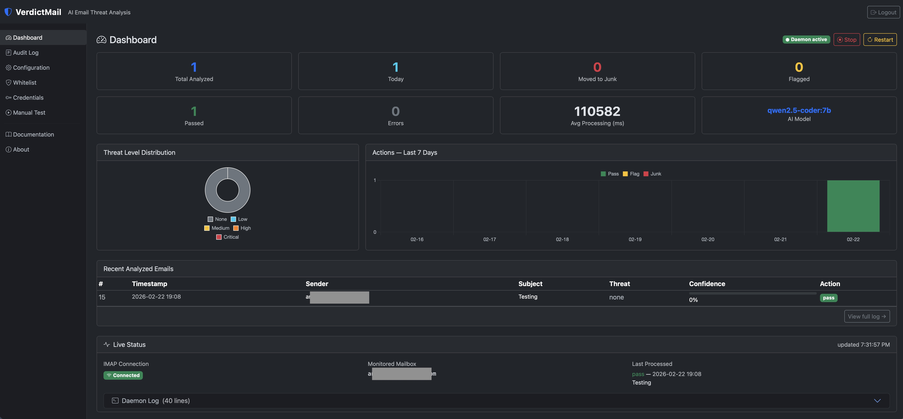
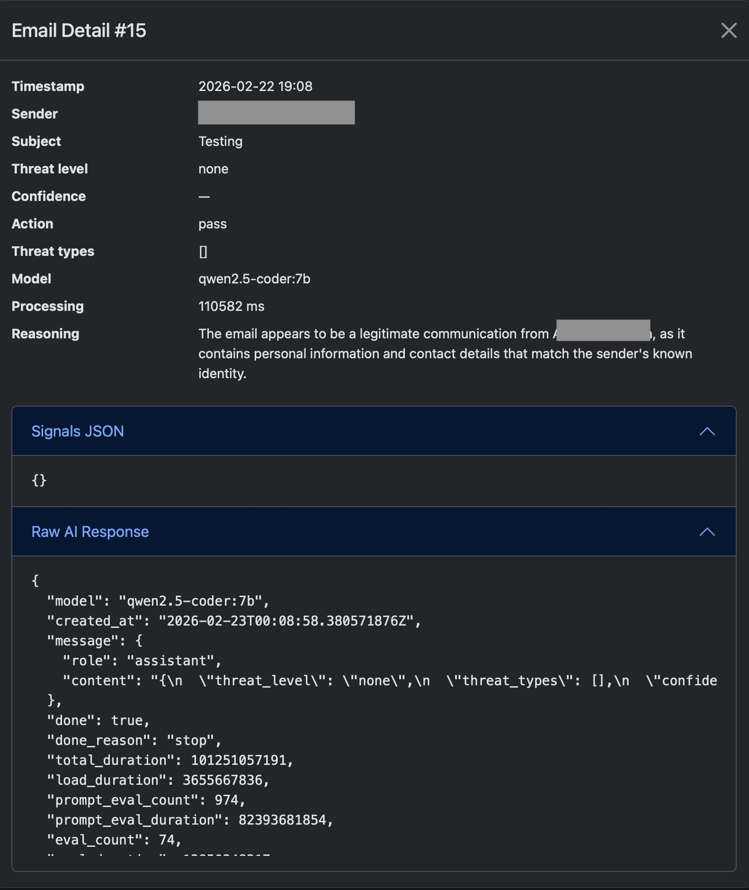
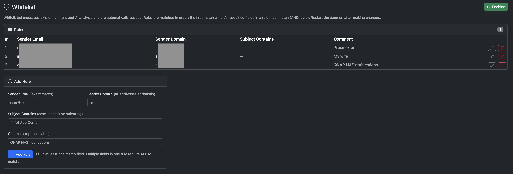

<p align="center">
  
</p>

# VerdictMail


AI-powered email security & triage daemon. Monitors your inbox via IMAP IDLE and runs every incoming message through a multi-stage enrichment and AI analysis pipeline — automatically passing, flagging, or moving suspicious mail and unwanted graymail to Junk.

---

## Features

- **Real-time monitoring** via IMAP IDLE (push, no polling)
- **Multi-stage pipeline**: parse → blacklist/whitelist check → enrich → AI → decide → act → audit
- **Enrichment signals**: SPF, DKIM, DMARC, DKIM alignment (cousin-domain `d=` mismatch detection), DNSBL reputation, WHOIS domain age, display-name spoofing, passive URL expansion (shorteners only — no beaconing), [URLhaus](https://urlhaus.abuse.ch) malware URL reputation, and [VirusTotal](https://www.virustotal.com) URL & IP reputation (90+ vendors)
- **AI providers**: OpenAI, Anthropic, or a local [Ollama](https://ollama.com) instance
- **Three actions**: pass (no change), flag (star or move to a Suspect folder), move to configured junk folder (default: `[Gmail]/Spam`)
- **Aggressiveness presets**: one-click sensitivity tuning (Conservative / Default / Aggressive / Very Aggressive) with fine-grained YAML override
- **Whitelist**: exempt trusted senders from analysis by email, domain, or subject pattern
- **Blacklist (always junk)**: senders that ignore unsubscribe requests can be moved straight to junk without analysis — addable in one click from the audit log
- **Graymail filter** (optional, off by default): classifies unsolicited bulk/commercial mail — promotional/marketing blasts, cold sales outreach, mass newsletters, notification digests — on an axis independent of the threat verdict, routing confident graymail to Junk and borderline graymail to Suspect
- **Web UI**: Flask admin interface — dashboard, audit log, configuration, whitelist, blacklist, credentials, manual test, documentation
- **Audit log**: full SQLite record of every decision including enrichment results (SPF, DKIM, DMARC, DNSBL, URLhaus, VirusTotal), AI signals, reasoning, and processing time — viewable per-message from the Audit Log page
- **Backup & restore**: export configuration (YAML only) or a full backup ZIP (YAML + credentials) from the web UI; restore via ZIP upload with a single click

---

## Screenshots

<table>
  <tr>
    <td align="center" colspan="2">
      
      <br/><em>Dashboard — live stats, threat distribution, 7-day action chart, and IMAP status</em>
    </td>
  </tr>
  <tr>
    <td align="center">
      
      <br/><em>Audit log — full AI reasoning, signals, and raw model response per email</em>
    </td>
    <td align="center">
      
      <br/><em>Whitelist — trusted sender rules by address, domain, or subject</em>
    </td>
  </tr>
</table>

---

## Architecture

```
IMAP IDLE (main thread)
    │
    └─▶ ThreadPoolExecutor (worker threads)
            │
            ├── message_parser   — RFC 822 parsing, URL extraction
            ├── blacklist        — user-marked "always junk/trash" senders → straight to junk or trash
            ├── whitelist        — bypass enrichment/AI for trusted senders
            ├── enrichment       — SPF/DMARC/DKIM/DKIM alignment/DNSBL/WHOIS/URL expansion/URLhaus/VirusTotal
            ├── ai_analyzer      — OpenAI / Anthropic / Ollama via httpx
            ├── decision_engine  — threshold logic → PASS / FLAG / MOVE_TO_JUNK
            ├── imap_actions     — star, move to suspect folder, or copy+delete to junk
            └── audit_logger     — SQLite + rotating log file
```

---

## Requirements

- Ubuntu 24.04 LTS (recommended) or 22.04 LTS, running as root for installation
- Python 3.11+ — Ubuntu 24.04 includes this by default; on 22.04 you may need to install it manually (`apt-get install python3.11 python3.11-venv`)
- An IMAP email account with IMAP access enabled. For Gmail: generate a [Gmail App Password](https://support.google.com/accounts/answer/185833) (Gmail Settings → See all settings → Forwarding and POP/IMAP → Enable IMAP, then Google Account → Security → App passwords). For other providers, see [Other IMAP providers](#other-imap-providers) below.
- Port 80 free on the host (used by the web UI)
- One of:
  - An OpenAI API key
  - An Anthropic API key
  - A running [Ollama](https://ollama.com) instance (local or remote) with a model pulled. 20B+ parameter models are recommended for reliable JSON schema adherence (e.g. `ollama pull gemma4:26b`). Smaller models work but may occasionally produce malformed responses. Models with thinking/reasoning mode (Qwen3, DeepSeek-R1, etc.) are fully supported — thinking is automatically disabled for latency-sensitive pipeline use.

---

## Installation

### Quick install (recommended)

Download and review the install script, then run it as root:

```bash
curl -sSL https://raw.githubusercontent.com/ascarola/verdictmail/main/install.sh -o install.sh
less install.sh        # review before running
sudo bash install.sh
```

The script handles all steps below automatically and prompts interactively for credentials, AI provider, model, and timezone. It is safe to re-run if something goes wrong partway through.

> **Note:** Requires Ubuntu 22.04 LTS or 24.04 LTS and Python 3.11+. Run as root or with `sudo`.

---

### Manual installation

If you prefer to install step by step, follow the instructions below.

### 1. Install system dependencies

```bash
apt-get update
apt-get install -y git python3 python3-venv python3-dev python3-pip \
                   build-essential libssl-dev sqlite3
```

### 2. Create the service user and directories

```bash
useradd -r -s /bin/false -M -d /opt/verdictmail verdictmail
mkdir -p /opt/verdictmail /var/log/verdictmail
chown verdictmail:verdictmail /opt/verdictmail /var/log/verdictmail
```

### 3. Clone the repository

```bash
git clone https://github.com/ascarola/verdictmail.git /opt/verdictmail
chown -R verdictmail:verdictmail /opt/verdictmail
```

### 4. Create the virtual environment and install dependencies

```bash
python3 -m venv /opt/verdictmail/venv
/opt/verdictmail/venv/bin/pip install --upgrade pip
/opt/verdictmail/venv/bin/pip install -r /opt/verdictmail/requirements.txt
chown -R verdictmail:verdictmail /opt/verdictmail/venv
```

### 5. Configure credentials

```bash
cp /opt/verdictmail/.env.example /opt/verdictmail/.env
chown verdictmail:verdictmail /opt/verdictmail/.env
chmod 600 /opt/verdictmail/.env
```

Edit `/opt/verdictmail/.env` and fill in your IMAP credentials and AI provider API key. Two optional threat intelligence keys can also be added: `URLHAUS_API_KEY` (free from [abuse.ch](https://abuse.ch/)) for malware URL lookups, and `VIRUSTOTAL_API_KEY` (free from [virustotal.com](https://www.virustotal.com)) for URL and IP reputation checks against 90+ security vendors. Both are silently skipped if not set.

### 6. Configure the application

```bash
cp /opt/verdictmail/config/verdictmail.yaml.example /opt/verdictmail/config/verdictmail.yaml
chown verdictmail:verdictmail /opt/verdictmail/config/verdictmail.yaml
```

Edit `/opt/verdictmail/config/verdictmail.yaml` and set at minimum:
- `ai.provider` and `ai.model`
- `timezone` (IANA name, e.g. `America/New_York`)

### 7. Install systemd units

```bash
cp /opt/verdictmail/systemd/verdictmail.service /etc/systemd/system/
cp /opt/verdictmail/systemd/verdictmail-web.service /etc/systemd/system/
systemctl daemon-reload
```

### 8. Install the sudoers rule (allows the web UI to restart the daemon)

```bash
cp /opt/verdictmail/systemd/verdictmail-sudoers /etc/sudoers.d/verdictmail
chmod 440 /etc/sudoers.d/verdictmail
```

### 9. Enable and start

```bash
systemctl enable --now verdictmail verdictmail-web
systemctl status verdictmail verdictmail-web
```

### 10. Verify installation via the web UI

Open a browser and navigate to:
```
http://<your-server-IP>
```

On first visit, VerdictMail will prompt you to set a web UI password. This password protects all admin pages. The scrypt hash is stored in `verdictmail.yaml` — the plaintext is never saved.

Once logged in, verify the daemon is running on the **Dashboard** and use the **Manual Test** page to confirm the full pipeline is working before relying on it for live mail.

---

## Configuration

All non-secret settings are in `/opt/verdictmail/config/verdictmail.yaml`.
See `config/verdictmail.yaml.example` for a fully-annotated template.
Changes require a daemon restart: `systemctl restart verdictmail`.

| Key | Default | Description |
|-----|---------|-------------|
| `ai.provider` | `openai` | AI backend: `openai`, `anthropic`, or `ollama` |
| `ai.model` | `gpt-4o-mini` | Model name passed to the provider |
| `ai.timeout_seconds` | `120` | Per-request AI timeout |
| `ai.base_url` | *(absent)* | Override the endpoint for the `openai` provider. Point it at any OpenAI-compatible server — a self-hosted AI gateway, LiteLLM, vLLM, LM Studio, etc. When absent, the official OpenAI cloud endpoint is used. See [Using an OpenAI-compatible gateway](#using-an-openai-compatible-gateway). |
| `ai.ollama_base_url` | `http://localhost:11434` | Ollama base URL (ollama provider only) |
| `thresholds.flag` | `0.72` | Minimum confidence to flag medium/high threat. Set via the Aggressiveness presets or custom threshold inputs on the Configuration page. |
| `thresholds.junk` | `0.90` | Minimum confidence to move high threat to Junk. Set via the Aggressiveness presets or custom threshold inputs on the Configuration page. |
| `imap.host` | `imap.gmail.com` | IMAP server |
| `imap.port` | `993` | IMAP SSL port |
| `imap.folder` | `INBOX` | Folder to monitor |
| `imap.junk_folder` | `[Gmail]/Spam` | Destination folder for MOVE_TO_JUNK actions (high/critical threat) (e.g. `Junk` on Fastmail/Outlook) |
| `imap.trash_folder` | `[Gmail]/Trash` | Destination folder for the `move_to_trash` action (blacklist with `action: trash`). Other providers: `Trash`, `INBOX.Trash`, `Deleted Messages` |
| `imap.suspect_folder` | *(absent)* | Optional. Destination folder for FLAG actions (medium threat). Create the folder/label first, then enter its exact IMAP name. When absent, flagged messages are starred (`\Flagged`) in-place. |
| `worker_threads` | `4` | Concurrent message processors |
| `startup_scan_limit` | `20` | Max unread messages to process on startup |
| `whitelist.enabled` | `true` | Master on/off for whitelist |
| `whitelist.rules` | `[]` | List of whitelist rule objects |
| `blacklist.enabled` | `true` | Master on/off for blacklist |
| `blacklist.action` | `junk` | Where blacklisted mail goes: `junk` (to `imap.junk_folder`, kept) or `trash` (to `imap.trash_folder`; on Gmail auto-deleted after 30 days) |
| `blacklist.rules` | `[]` | List of blacklist rule objects (same schema as whitelist) |
| `graymail.enabled` | `false` | Master on/off for the graymail filter (unsolicited bulk/commercial mail). Off by default |
| `graymail.flag_threshold` | `0.6` | Minimum graymail confidence to send detected graymail to the Suspect folder (must be ≤ `graymail.junk_threshold`) |
| `graymail.junk_threshold` | `0.85` | Minimum graymail confidence to move detected graymail to Junk |
| `timezone` | `UTC` | IANA timezone for dashboard and audit log |

---

## Using an OpenAI-compatible gateway

VerdictMail's `openai` provider speaks the standard OpenAI Chat Completions protocol, so it can target **any OpenAI-compatible endpoint** — not just OpenAI's cloud. That includes self-hosted AI gateways, [LiteLLM](https://github.com/BerriAI/litellm), [vLLM](https://github.com/vllm-project/vllm), LM Studio, and similar proxies. This lets you keep inference on your own network (or route it through a single keyed gateway) while still benefiting from a hosted model's schema reliability.

**Migrating from a direct Ollama setup:** if you currently run `provider: ollama` (keyless, pointed straight at an Ollama box) and want to move behind a gateway that requires an API key, you do **not** touch your Ollama config — you switch providers:

1. Set the gateway key in `/opt/verdictmail/.env`:
   ```dotenv
   OPENAI_API_KEY=your-gateway-api-key
   ```
2. Point the `openai` provider at the gateway in `config/verdictmail.yaml`:
   ```yaml
   ai:
     provider: openai
     model: gemma4:26b                       # any model id the gateway exposes
     base_url: http://192.168.1.243:5010/v1  # your gateway's OpenAI base URL (note the /v1)
     timeout_seconds: 180
     ollama_base_url: http://192.168.1.62:11434  # kept for easy rollback (ignored while provider=openai)
   ```
3. Restart: `systemctl restart verdictmail`. The startup log line confirms the target:
   `AI provider: openai | model: gemma4:26b | base_url: http://192.168.1.243:5010/v1`

**Rollback** is a one-line change: set `provider: ollama` and restart — your `ollama_base_url` is still there.

Notes:
- The `base_url` must include the API version path your gateway expects (usually `/v1`).
- The gateway must implement `POST /chat/completions` with `response_format: {"type": "json_object"}`. VerdictMail tolerates responses that fence or wrap the JSON.
- When `base_url` is set, VerdictMail sends `"think": false` in the request body to disable model "thinking"/reasoning — it discards reasoning entirely, so on Ollama-backed models this is pure latency and wasted tokens (e.g. `gemma4:26b` drops from ~40 s to a few seconds per message). The field is passed straight through to Ollama and is a harmless no-op for models without a thinking mode. It is **not** sent to OpenAI cloud (`base_url` absent), which rejects unknown fields and whose reasoning models you would not want to disable.
- Direct-Ollama users who need no key can keep `provider: ollama` unchanged — nothing about that path has changed.

---

## Other IMAP providers

VerdictMail is developed and tested against Gmail, but the underlying IMAP code uses only standard RFC-compliant operations (IMAP IDLE, COPY, DELETE, EXPUNGE) and should work with any IMAP server that supports IDLE.

Set `IMAP_USERNAME` and `IMAP_PASSWORD` in `.env` to your account credentials, then update the IMAP settings in `verdictmail.yaml`:

| Provider | `imap.host` | `imap.port` | `imap.junk_folder` |
|----------|-------------|-------------|-------------------|
| Gmail | `imap.gmail.com` | `993` | `[Gmail]/Spam` |
| Fastmail | `imap.fastmail.com` | `993` | `Junk` |
| Outlook / Hotmail | `outlook.office365.com` | `993` | `Junk` |
| Apple iCloud | `imap.mail.me.com` | `993` | `Junk` |

> **Note:** Non-Gmail providers are not officially tested. If your provider requires an app-specific password or has two-factor authentication, generate a dedicated app password following your provider's documentation.

---

## Actions

| Action | When | Effect |
|--------|------|--------|
| `pass` | Clean mail, low threat, or whitelisted | No IMAP changes |
| `flag` | Medium/high threat at sufficient confidence | If `imap.suspect_folder` is configured: moves message there. Otherwise: stars the message (`\Flagged`) in-place. |
| `move_to_junk` | High/critical threat at high confidence, or blacklisted sender (when `blacklist.action: junk`) | Copies to the configured junk folder (`imap.junk_folder`, default `[Gmail]/Spam`), deletes original |
| `move_to_trash` | Blacklisted sender when `blacklist.action: trash` | Copies to the configured trash folder (`imap.trash_folder`, default `[Gmail]/Trash`), deletes original. On Gmail, Trash is auto-purged after 30 days |

---

## Whitelist

The whitelist bypasses enrichment and AI analysis for trusted senders. Rules are evaluated in order; the first match wins.

Each rule matches on one or more of:
- `sender` — exact email address (case-insensitive)
- `sender_domain` — all addresses at a domain
- `subject_contains` — case-insensitive substring of Subject

Multiple fields in one rule require **all** to match (AND logic). Manage rules via the web UI or by editing `verdictmail.yaml` directly (restart required).

---

## Blacklist (always junk / trash)

The blacklist is the mirror image of the whitelist: matching messages skip enrichment and AI analysis and move straight out of the inbox. Use it as an override for senders that ignore unsubscribe/opt-out requests.

- Same rule schema and matching logic as the whitelist (`sender`, `sender_domain`, `subject_contains`, `comment`)
- **Destination is configurable** via the **Action** toggle on the Blacklist page (`blacklist.action`): `junk` (default — moves to `imap.junk_folder`, kept) or `trash` (moves to `imap.trash_folder`; on Gmail, Trash is auto-purged after 30 days, so matched senders effectively delete on a delay). Both use a safe copy-then-delete — a bare IMAP delete would *not* reach Gmail's Trash.
- **Takes precedence over the whitelist** — if a sender matches both, the blacklist action wins (the web UI warns about conflicting rules)
- Add rules from the Blacklist page, or from any message's detail view in the Audit Log via the **Junk Sender** button
- Logged with `action=move_to_junk` (or `move_to_trash`) and `model_name="blacklist"` so user-mandated actions are distinguishable from AI verdicts

---

## Graymail filter (unsolicited marketing)

Graymail is unsolicited bulk/commercial mail that isn't a security threat but isn't wanted either — promotional/marketing blasts, cold sales outreach, mass newsletters, and notification digests. The AI analyzer classifies it on a **separate axis** from the threat verdict, so marketing never inflates the threat level and genuine threat detection is unaffected.

- Categories: `promotional`, `cold_outreach`, `newsletter`, `notification` (and `none` for personal/transactional mail, which always stays in the inbox)
- The graymail axis is consulted **only when the threat verdict would otherwise pass** — a real threat always takes precedence and is never downgraded
- Confident graymail (≥ `graymail.junk_threshold`) → the configured Junk folder (`imap.junk_folder`); borderline (≥ `graymail.flag_threshold`) → the flag action (the Suspect folder, or starred ⭐ in place if `imap.suspect_folder` is unset); below that → inbox
- **Whitelisted senders are always exempt** — whitelist a sender to keep a newsletter you actually want
- **Off by default.** Enable and tune the thresholds in the *Graymail Filter* card on the Configuration page, or via the `graymail` section in `verdictmail.yaml`
- The category and confidence are recorded in the audit log and shown on the message detail and Manual Test pages

---

## Web UI

The Flask admin interface runs on port 80 alongside the daemon.

| Page | Path | Description |
|------|------|-------------|
| Dashboard | `/` | Stats, threat chart, recent emails, service status; start/stop/restart daemon |
| Audit Log | `/audit` | Paginated, searchable table with full-detail modal |
| Configuration | `/config` | In-browser YAML editor + AI provider quick-config |
| Whitelist | `/whitelist` | Add, edit, and delete whitelist rules |
| Blacklist | `/blacklist` | Add, edit, and delete always-junk rules |
| Credentials | `/credentials` | IMAP credentials and API key management |
| Manual Test | `/test` | Dry-run pipeline on a submitted email |
| Documentation | `/docs` | In-app reference manual |
| Configuration (Backup) | `/config/export` | Download `verdictmail.yaml` |
| Configuration (Full Backup) | `/config/export/full` | Download ZIP of `verdictmail.yaml` + `.env` |
| About | `/about` | Version and tech stack info |

A web UI password is set on first visit. The password hash is stored in `verdictmail.yaml`; the plaintext password is never stored.

> **Security note:** The web UI runs on plain HTTP (port 80) with no TLS. Credentials and session cookies are transmitted in cleartext. This is acceptable on a trusted home or private LAN, but you should not expose port 80 directly to the internet. If remote access is needed, place the UI behind a reverse proxy with TLS (e.g. nginx + Let's Encrypt) or access it over a VPN.

---

## Verification

### Start / stop / restart the daemon from the web UI

The Dashboard provides **Stop**, **Start/Resume**, and **Restart** buttons.
VerdictMail auto-detects its environment and chooses the appropriate control strategy:

| Environment | Strategy | Stop behaviour |
|-------------|----------|----------------|
| Bare metal / privileged container | `sudo systemctl` | Daemon fully stopped; unit marked inactive |
| Unprivileged LXC (e.g. Proxmox) | Signal + pause flag | Daemon stays running but skips incoming messages; emails remain UNSEEN until resumed |

### Check Ollama connectivity (if using Ollama provider)

```bash
curl http://localhost:11434/api/tags
```

### Test IMAP connectivity

```bash
python3 -c "
import imapclient
c = imapclient.IMAPClient('imap.example.com', ssl=True)  # replace with your IMAP host
c.login('YOUR_IMAP_USERNAME', 'YOUR_IMAP_PASSWORD')
print(c.list_folders())
c.logout()
"
```

### Run the unit tests

```bash
# Install dev dependencies (includes pytest)
/opt/verdictmail/venv/bin/pip install -r /opt/verdictmail/requirements-dev.txt

PYTHONPATH=src /opt/verdictmail/venv/bin/python -m pytest tests/ -v
```

The test suite covers:

| File | What it tests |
|------|---------------|
| `test_message_parser.py` | RFC 2822 parsing, header extraction, URL extraction, DKIM signature parsing |
| `test_decision_engine.py` | All 7 decision rules, boundary conditions at both thresholds, threshold configuration variants, case insensitivity |
| `test_ai_analyzer.py` | JSON extraction from plain/fenced/embedded text, response schema validation, all `_build_user_prompt` sections and conditional blocks (URLhaus, VirusTotal, DKIM alignment, PBL note, body truncation) |

### Watch live logs

```bash
journalctl -u verdictmail -f
tail -f /var/log/verdictmail/verdictmail.log
```

### Inspect the audit database

```bash
sqlite3 /var/log/verdictmail/verdictmail.db \
  "SELECT id, subject, threat_level, printf('%.0f%%', confidence*100),
          action_taken, reasoning
   FROM audit_log ORDER BY id DESC LIMIT 10;"
```

---

## Troubleshooting

| Symptom | Check |
|---------|-------|
| Service won't start | `journalctl -u verdictmail -n 50` — look for config or credential errors |
| AI timeouts | Verify provider connectivity and `ai.timeout_seconds` |
| IMAP auth failure | Confirm credentials are correct (App Password for Gmail; provider-specific password for others) and that IMAP is enabled in your provider's settings |
| No messages processed | The daemon processes new/unseen messages; use the **Manual Test** page to verify the pipeline works |
| DNSBL slow | DNS resolution timeouts are 3 s per list; check network connectivity |
| URLhaus test times out | Verify outbound HTTPS to `urlhaus-api.abuse.ch` is allowed by your firewall. URLhaus lookups are silently skipped if the key is absent, so the daemon will still work without them. |

---

## Upgrading

### v0.6.0 — Blacklist: move to Trash instead of Junk

A backward-compatible feature release with **no breaking changes** — pull and restart:

```bash
git -C /opt/verdictmail pull
systemctl restart verdictmail verdictmail-web
```

The Blacklist page gains a **Junk ⇄ Trash** action toggle (`blacklist.action`). Set it to
**Move to Trash** to route blacklisted mail straight to the Trash folder instead of Spam — on
Gmail, Trash is auto-purged after 30 days, so matched senders effectively delete on a delay.
A new configurable **Trash folder** (`imap.trash_folder`, default `[Gmail]/Trash`) on the
Configuration page supports non-Gmail servers (`Trash`, `INBOX.Trash`, `Deleted Messages`).

Both moves use the same safe copy-then-delete as the Junk action — a bare IMAP delete would
*not* reach Gmail's Trash (the message would linger in All Mail). **No breaking changes:**
`blacklist.action` defaults to `junk`, so existing setups behave exactly as before until you
opt in.

### v0.5.1 — Fetch models for the OpenAI provider

A small UI addition to v0.5.0 — pull and restart:

```bash
git -C /opt/verdictmail pull
systemctl restart verdictmail verdictmail-web
```

The Configuration page's **Fetch available models** button (previously Ollama-only) now also works
for the `openai` provider: it queries the standard `GET {base_url}/models` on your configured
endpoint — OpenAI cloud or a self-hosted gateway — and populates the model dropdown so you can
pick from what the endpoint actually advertises instead of typing model ids by hand. No config,
schema, or breaking changes.

### v0.5.0 — OpenAI-compatible AI gateway support

A backward-compatible feature release with **no breaking changes** — upgrade is a pull and
restart:

```bash
git -C /opt/verdictmail pull
systemctl restart verdictmail verdictmail-web
```

The `openai` provider can now target **any OpenAI-compatible endpoint** — a self-hosted AI
gateway, LiteLLM, vLLM, LM Studio, etc. — by setting `ai.base_url` in
`config/verdictmail.yaml` and putting the endpoint's key in `.env` as `OPENAI_API_KEY`. This
lets you route inference through a single keyed gateway (or keep it entirely on your own
network) instead of straight-to-Ollama or straight-to-OpenAI-cloud. See
[Using an OpenAI-compatible gateway](#using-an-openai-compatible-gateway).

When `ai.base_url` is set, VerdictMail also sends `"think": false` in the request body to
disable model reasoning. VerdictMail discards reasoning entirely, so on Ollama-backed models
this is pure latency and wasted tokens — in testing, `gemma4:26b` dropped from ~40 s to a few
seconds per message. The field is a harmless no-op for models without a thinking mode and is
never sent to OpenAI cloud (`base_url` absent), which rejects unknown fields.

**Nothing changes for existing users.** Direct-Ollama setups (`provider: ollama`) and
OpenAI-cloud setups (`provider: openai`, no `base_url`) behave exactly as before — the new
behavior only activates when you set `ai.base_url`. Rollback from a gateway is a one-line
change: set `provider` back to `ollama` and restart.

### v0.4.1 — Scoring calibration fix

A prompt-tuning fix with **no config, schema, or breaking changes** — upgrade is just a pull
and restart:

```bash
git -C /opt/verdictmail pull
systemctl restart verdictmail verdictmail-web
```

Earlier builds could let the AI collapse its scoring to extremes — threat verdicts skipping
**medium**, and graymail confidence always landing at the top of the range. That starved the
**Suspect** folder, since both of its feeders (medium-level threats and borderline graymail)
sit in the middle of the scale. This release retunes the analysis prompt to use the full
0.0–1.0 range and to choose **medium** for genuine-but-unconfirmed suspicion, restoring
Suspect-folder triage. Threat detection for clear phishing/malware is unchanged.

### v0.4.0 — Graymail filter and legacy credential-variable removal

Feature addition with a database migration (two new audit-log columns, applied
automatically on first start) and **one breaking change**.

```bash
git -C /opt/verdictmail pull
systemctl restart verdictmail verdictmail-web
```

- **New graymail filter**: VerdictMail now classifies unsolicited bulk/commercial mail
  (promotional/marketing blasts, cold sales outreach, mass newsletters, notification
  digests) on an axis independent of the threat verdict, so marketing never inflates the
  security threat level. Confident graymail is moved to **Junk**; borderline graymail
  goes to **Suspect**. Whitelisted senders are exempt. **Off by default** — enable it and
  tune the Suspect/Junk thresholds in the *Graymail Filter* card on the Configuration
  page, or set `graymail.enabled: true` in `verdictmail.yaml`:

  ```yaml
  graymail:
    enabled: true
    flag_threshold: 0.6    # → Suspect (borderline)
    junk_threshold: 0.85   # → Junk (confident)
  ```

- **Breaking — legacy credential variables removed**: the `GMAIL_USERNAME` /
  `GMAIL_APP_PASSWORD` environment variables (deprecated in v0.3.0) are no longer read.
  If your `.env` still uses them, rename them to `IMAP_USERNAME` / `IMAP_PASSWORD` before
  upgrading or the daemon will exit on startup.

---

### v0.3.9 — Security: hardened redirect validation

Non-breaking security fix. Pull and restart:

```bash
git -C /opt/verdictmail pull
systemctl restart verdictmail verdictmail-web
```

- **Hardened `_safe_next_url`**: the post-login / post-action redirect helper now rejects backslash payloads (`/\evil.com`, which browsers normalize into the external host `//evil.com`) and CR/LF/control characters (header injection), in addition to the absolute and protocol-relative URLs it already blocked. Only single-slash-rooted local paths are accepted. Resolves CodeQL `py/url-redirection` alerts.

---

### v0.3.8 — Blacklist (always junk) and recalibrated thresholds

Non-breaking feature addition. No action required other than pulling and restarting:

```bash
git -C /opt/verdictmail pull
systemctl restart verdictmail verdictmail-web
```

- **Blacklist**: New `blacklist` section in `verdictmail.yaml` (same rule schema as the whitelist). Matching senders skip analysis and move straight to junk — an override for senders that ignore unsubscribe requests. Manage rules on the new Blacklist page or via the **Junk Sender** button in the Audit Log detail view. The blacklist takes precedence over the whitelist.
- **Recalibrated Aggressiveness presets**: The four presets are now spaced within the confidence range LLMs actually emit (actionable verdicts empirically score 0.6–1.0; the old `0.22`–`0.55` flag thresholds were below that floor, making three of the four presets behave identically). New values: Conservative `0.80/0.97`, Default `0.72/0.90`, Aggressive `0.65/0.82`, Very Aggressive `0.55/0.72`. **Existing installs keep their current YAML values** — re-select your preset on the Configuration page to adopt the new calibration.
- **Custom thresholds in the UI**: The Configuration page Aggressiveness card now has direct flag/junk threshold inputs for models whose confidence distribution doesn't match the presets.
- **Decision rule tightened**: A `high`-threat verdict where the AI recommends quarantine/junk/block now requires confidence ≥ the midpoint of the flag and junk thresholds (previously only the flag threshold, which let the AI's recommendation bypass the junk threshold entirely).
- **Audit display fix**: Whitelisted/blacklisted messages no longer show "Not available — recorded before v0.3.3" in the Enrichment section; they now correctly state that enrichment was skipped by rule.

---

### v0.3.7 — Suspect folder and visible flag action

Non-breaking feature addition. No action required other than pulling and restarting:

```bash
git -C /opt/verdictmail pull
systemctl restart verdictmail verdictmail-web
```

- **Suspect folder**: The `flag` action (medium-threat mail) can now move messages to a dedicated IMAP folder instead of leaving them in the inbox. Create a folder/label in your mail client (Gmail: create a label, e.g. `Suspect`), then set `imap.suspect_folder` in `verdictmail.yaml` or via the web UI Configuration page → IMAP Folders.
- **Visible flag default**: When `suspect_folder` is not configured, flagged messages are now starred (`\Flagged` — the Gmail yellow star) instead of the previous invisible `$VerdictMail-Suspect` IMAP keyword. This is a behaviour change from v0.3.6, but strictly better for all users.
- **Install script**: The interactive installer now prompts for a suspect folder and validates it against the IMAP server before writing to config.
- **Web UI**: New IMAP Folders card on the Configuration page exposes both `junk_folder` and `suspect_folder` without needing to edit YAML directly.

---

### v0.3.6 — JSON robustness and Ollama multi-model safety

Non-breaking fix. No action required other than pulling, installing dependencies, and restarting:

```bash
git -C /opt/verdictmail pull
/opt/verdictmail/venv/bin/pip install -r /opt/verdictmail/requirements.txt
systemctl restart verdictmail verdictmail-web
```

> **Note:** VerdictMail runs inside a Python virtual environment at `/opt/verdictmail/venv`. Always use `/opt/verdictmail/venv/bin/pip` — not a bare `pip` command — when installing dependencies, or the package will land in the system Python and the service will not see it.

- **`json-repair` dependency**: Added `json-repair` library as a fallback JSON parser. When `qwen2.5:7b` or other small models produce truncated JSON, invalid escape sequences (e.g. `\'`), or other malformed output, `json-repair` recovers the response automatically rather than exhausting all retries and recording `action=error`. **Existing installs must run the venv pip command above to pick this up.**
- **Ollama `num_ctx` override removed**: VerdictMail was sending `num_ctx: 8192` in every Ollama request. If this value differs from the context window the model was loaded with, Ollama reloads the model — briefly evicting it from VRAM and disrupting other users sharing the same Ollama instance. VerdictMail now uses whatever context window the model was already loaded with. For reference, `gemma4:26b` loaded at 32,768 tokens comfortably covers the observed maximum prompt size of ~8,300 tokens.

**Recommended model: `gemma4:26b`**
If you have a capable Ollama server, switching to `gemma4:26b` (or another 20B+ model) is strongly recommended over `qwen2.5:7b`. The JSON schema compliance issues that drove the v0.3.3–v0.3.6 fixes are rooted in small model unreliability. Larger models follow the required output schema consistently. Update `ai.model` in your `config/verdictmail.yaml`:
```yaml
ai:
  model: gemma4:26b
```

---

### v0.3.5 — AI response resilience fixes

Non-breaking fix. No action required other than pulling and restarting:

```bash
git -C /opt/verdictmail pull
systemctl restart verdictmail verdictmail-web
```

- **Schema unwrapping**: Some emails caused `qwen2.5:7b` to consistently wrap its response in a nested object (e.g. `{"analysis": {...}}`) rather than returning the flat schema directly. These messages were recorded as `action=error` in the audit log — completely unanalyzed. The JSON extractor now detects and unwraps one level of nesting automatically.
- **Failure diagnostics**: When AI response validation fails, the first 300 characters of the model's actual output are now logged to the journal, making future schema mismatches diagnosable without database archaeology.
- **WHOIS log suppression corrected**: The v0.3.4 fix used `setLevel(WARNING)` which still passes `ERROR` messages through (ERROR > WARNING). Changed to `setLevel(CRITICAL)` on the parent `whois` logger to fully silence the noise.

---

### v0.3.4 — Ollama reliability and log hygiene

Non-breaking fix. No action required other than pulling and restarting:

```bash
git -C /opt/verdictmail pull
systemctl restart verdictmail verdictmail-web
```

- **Ollama JSON mode**: Added `"format": "json"` to all Ollama API requests. Ollama's grammar-constrained sampling now enforces syntactically valid JSON at the token level, eliminating the intermittent parse-error retries that added 10–30 s of latency per affected message. Retry logic is retained for connection errors.
- **WHOIS log noise**: Suppressed the `whois.whois` library's internal `ERROR` log entries for transient socket timeouts. Timeout failures are still captured in each message's enrichment `error_notes`; they were already handled gracefully — only the false-alarm `[ERROR]` journal noise is removed.

---

### v0.3.3 — Enrichment data in audit log

Non-breaking feature addition. The database schema is migrated automatically on daemon startup — no manual steps required.

```bash
git -C /opt/verdictmail pull
systemctl restart verdictmail verdictmail-web
```

The audit log Detail modal now shows a full **Enrichment** panel for every processed message: SPF/DKIM/DMARC pass/fail badges, display-name spoofing detection, domain age, DNSBL classification (including PBL-only distinction), URLhaus and VirusTotal results, DKIM alignment, and expanded URLs. A new `enrichment` column is added to the SQLite `audit_log` table. Records written before v0.3.3 show *"Not available — recorded before v0.3.3."*

---

### v0.3.2 — Fast shutdown fix

Non-breaking bug fix. No action required other than pulling and restarting:

```bash
git -C /opt/verdictmail pull
systemctl restart verdictmail
```

Fixes a 150-second forced shutdown delay that occurred when the daemon was
restarted while in exponential backoff (e.g. after importing a backup ZIP on
a fresh install with dummy credentials). Shutdown is now instant.

---

### v0.3.1 — Backup & restore

Non-breaking feature addition. No action required when upgrading from v0.3.0.

A **Backup & Restore** card is now available on the Configuration page:
- **Export Config** — downloads `verdictmail.yaml` (no credentials)
- **Export Full Backup** — downloads a dated ZIP of `verdictmail.yaml` + `.env` (contains credentials — store securely)
- **Import Config** — uploads a `verdictmail.yaml` to replace the live config
- **Import Full Backup** — uploads a backup ZIP to restore both `verdictmail.yaml` and `.env` in one step

---

### v0.3.0 — IMAP credential variable rename

The environment variables have been renamed for provider-agnostic clarity:

| Old (v0.2.x)          | New (v0.3.0+)      |
|-----------------------|--------------------|
| `GMAIL_USERNAME`      | `IMAP_USERNAME`    |
| `GMAIL_APP_PASSWORD`  | `IMAP_PASSWORD`    |

**Action required:** Edit `/opt/verdictmail/.env` and rename the two variables.
The old names worked (with a deprecation warning) through v0.3.x and were **removed
in v0.4.0** — `IMAP_USERNAME` and `IMAP_PASSWORD` are now required.

---

## Log rotation

The rotating file handler caps each log file at 10 MB with 5 backups retained.
System-level rotation with `logrotate` is not required but can be added at `/etc/logrotate.d/verdictmail`.

---

## Development Notes

VerdictMail was designed and architected by A. Scarola. The implementation 
was developed with substantial assistance from [Claude Code](https://claude.ai/code) 
(Anthropic's AI coding assistant), which wrote the majority of the code based on 
detailed specifications, requirements, and iterative direction from the author. 
All design decisions, security architecture, feature choices, and testing were 
directed and validated by the author.

---

## License

MIT — see [LICENSE](LICENSE).
